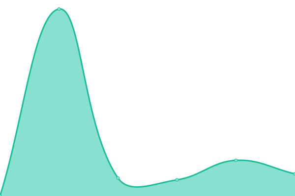

# [📈 Live Status](https://demo.upptime.js.org): <!--live status--> **🟧 Partial outage**

This repository contains the open-source uptime monitor and status page for [Novigo Technology](https://www.novigo.com.ar/), powered by [Upptime](https://github.com/upptime/upptime).

With [Upptime](https://upptime.js.org), you can get your own unlimited and free uptime monitor and status page, powered entirely by a GitHub repository. We use [Issues](https://github.com/novigotechnology/uptime-nagus/issues) as incident reports, [Actions](https://github.com/novigotechnology/uptime-nagus/actions) as uptime monitors, and [Pages](https://demo.upptime.js.org) for the status page.

<!--start: status pages-->
<!-- This summary is generated by Upptime (https://github.com/upptime/upptime) -->
<!-- Do not edit this manually, your changes will be overwritten -->
<!-- prettier-ignore -->
| URL | Status | History | Response Time | Uptime |
| --- | ------ | ------- | ------------- | ------ |
|  [WWW](https://www.nagus.app) | 🟩 Up | [www.yml](https://github.com/NovigoTechnology/uptime-nagus/commits/HEAD/history/www.yml) | 

 3760ms
     
 | 

<a href="https://novigotechnology.github.io/uptime-nagus/history/www">100.00%</a>
    

|  [Demo](https://demo.nagus.app) | 🟩 Up | [demo.yml](https://github.com/NovigoTechnology/uptime-nagus/commits/HEAD/history/demo.yml) | 

 3389ms
     
 | 

<a href="https://novigotechnology.github.io/uptime-nagus/history/demo">80.61%</a>
    

|  [Docs](https://docs.nagus.app) | 🟥 Down | [docs.yml](https://github.com/NovigoTechnology/uptime-nagus/commits/HEAD/history/docs.yml) | 

 0ms
     
 | 

<a href="https://novigotechnology.github.io/uptime-nagus/history/docs">0.61%</a>
    

<!--end: status pages-->

[**Visit our status website →**](https://demo.upptime.js.org)

## 📄 License

- Powered by: [Upptime](https://github.com/upptime/upptime)
- Code: [MIT](./LICENSE) © [Novigo Technology](https://www.novigo.com.ar/)
- Data in the `./history` directory: [Open Database License](https://opendatacommons.org/licenses/odbl/1-0/)
